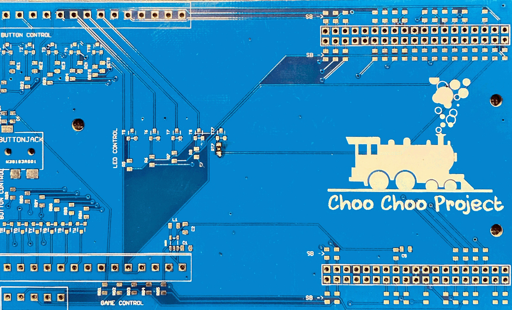

# UW Madison Independent Studies

In my time un University I undertook two independent study projects ( ECE 399 ).

## Mr Choo Choo

Reversed engineered an apple shaped Alphabet toy and added custom hardware to allow for a large button to select the lit up letter so that kiddos with motor function issues can play.

## Modular Power Switcher

This device is meant to be a modular power switcher meant for underprivileged countries to have a cheap and modular power converter for many applications.